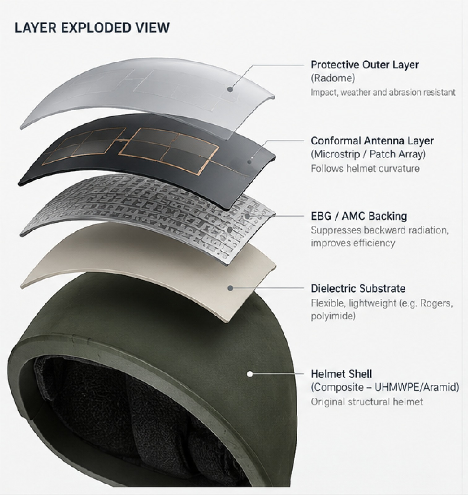
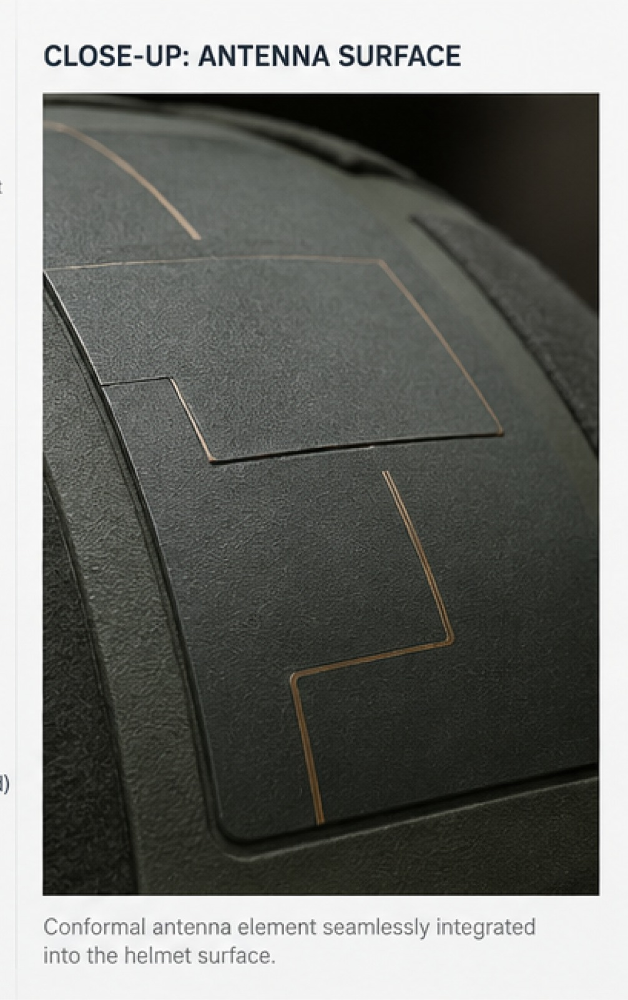
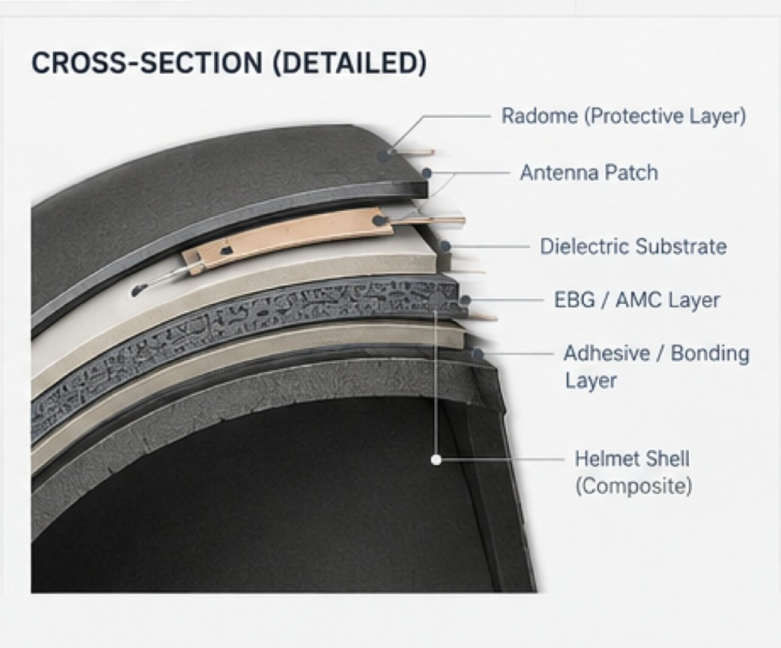

# Antenna Architecture

## KAVACH-RF

The proposed KAVACH-RF antenna uses a **low-profile conformal structure** designed for integration with the helmet surface.

The architecture is being investigated for the two operating regions currently defined in the project:

* **UHF — 446 MHz target**
* **L-band — 1.575 GHz target**

---

## 1. Proposed Antenna Structure



The proposed structure consists of multiple functional layers arranged between the outer protective surface and the helmet shell.

The layered approach allows the electromagnetic and mechanical properties of the antenna system to be considered together.

---

## 2. Conformal Antenna Surface



The radiating structure is intended to follow the available helmet geometry rather than forming a conventional externally protruding antenna.

The final radiator geometry will be determined through electromagnetic simulation and prototype validation.

---

## 3. Layer Stack

```text
              OUTSIDE
                 ↓
        ┌─────────────────────┐
        │ Protective / Radome │
        ├─────────────────────┤
        │ Conformal Radiator  │
        ├─────────────────────┤
        │ Dielectric Substrate│
        ├─────────────────────┤
        │ EBG / AMC Structure │
        ├─────────────────────┤
        │ Bonding Layer       │
        ├─────────────────────┤
        │ Helmet Shell        │
        └─────────────────────┘
                 ↓
                USER
```

### Functional layers

**Protective / Radome Layer**
Provides physical protection to the antenna structure.

**Conformal Radiator**
Contains the conductive RF radiating structure.

**Dielectric Substrate**
Provides mechanical support and forms part of the electromagnetic structure.

**EBG / AMC Structure**
The proposed design investigates an electromagnetic surface beneath the radiator. Its effect on antenna performance will be evaluated through simulation and measurement.

**Bonding Layer**
Provides mechanical attachment between the antenna structure and helmet surface. Its thickness and material properties can influence RF behaviour.

**Helmet Shell**
Provides the mechanical integration platform. Its geometry and material properties can influence the antenna's electromagnetic behaviour.

---

## 4. Antenna Cross-Section



The cross-section represents the relationship between the antenna layers and the helmet structure.

The integrated design needs to consider both:

* **RF characteristics**
* **Mechanical integration**

---

## 5. Design Considerations

The antenna architecture is being evaluated with respect to:

* Helmet curvature
* Available mounting area
* Antenna-to-helmet interaction
* Human-body proximity
* RF feed routing
* Mechanical attachment
* Impedance matching
* Radiation characteristics
* Material properties

---

## 6. RF Integration

The antenna connects to the communication system through an RF feed and matching interface.

```text
Conformal Radiator
        │
        ▼
   RF Feed / Port
        │
        ▼
 Matching Network
        │
        ▼
Communication Radio
```

The target system impedance is:

**50 Ω**

---

## 7. Current Design Approach

Separate electromagnetic models are currently being investigated for the UHF and L-band operating regions.

| Band   |    Target | Current Simulation | Current Status        |
| ------ | --------: | -----------------: | --------------------- |
| UHF    |   446 MHz |         522.67 MHz | Frequency retuning    |
| L-band | 1.575 GHz |         1.5755 GHz | Matching optimization |

These values represent the **current simulation stage** and are not final experimental measurements.

---

## 8. Design Principle

The antenna is treated as an **integrated helmet–antenna system** rather than as an isolated radiator.

Therefore, the development considers:

```text
Antenna Geometry
       +
Material Stack
       +
Helmet Curvature
       +
Feed Configuration
       +
Human-Body Proximity
       ↓
Integrated RF Performance
```

---

## 9. Development Status

The current architecture represents the **proposed design direction**.

The following parameters remain subject to optimization:

* Final radiator geometry
* Substrate selection
* Layer thickness
* EBG / AMC geometry
* Feed location
* Matching network
* Helmet integration

The final design will be established through **simulation followed by physical RF validation**.

---

## Related Documentation

* [`Design Overview`](design-overview.md)
* [`Frequency Plan`](frequency-plan.md)
* [`Materials`](materials.md)
* [`Simulation`](../04_Simulation/)
