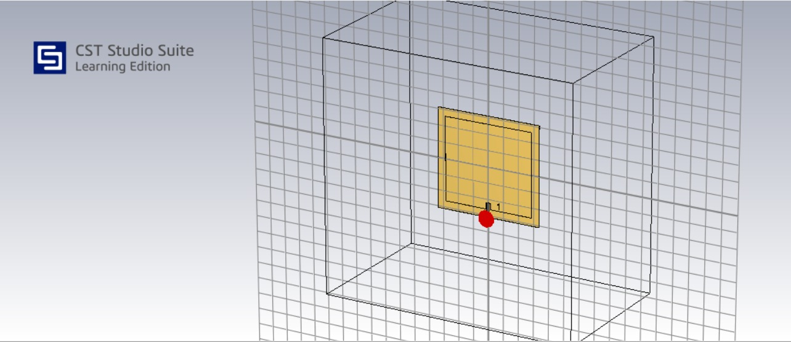
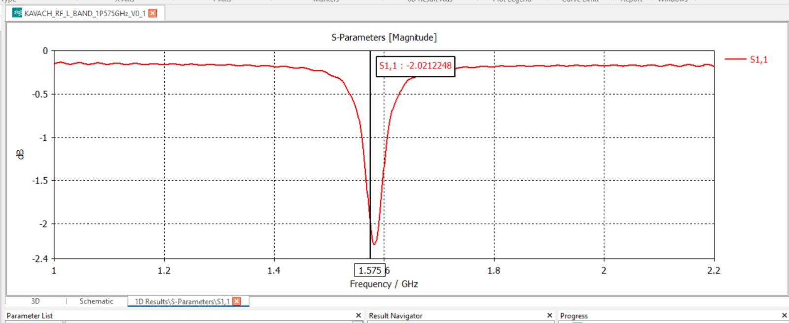

# L-Band Antenna Simulation

## Target

**Target frequency:** 1.575 GHz

The L-band configuration is being investigated as a separate operating configuration of the KAVACH-RF antenna system.

---

## CST 3D Model

The antenna geometry was modelled and simulated using **CST Studio Suite**.



The model is used to study the electromagnetic behaviour of the proposed antenna geometry at the L-band operating frequency.

---

## S11 Simulation



The S11 response is used to evaluate the impedance matching and resonant behaviour of the antenna.

**Simulated resonance:** approximately **1.5755 GHz**

---

## Target vs Simulation

| Parameter |          Target |          Simulation |
| --------- | --------------: | ------------------: |
| Frequency |       1.575 GHz |         ~1.5755 GHz |
| S11       | To be evaluated | See simulation plot |

---

## Design Objective

The L-band simulation is used to evaluate:

* Resonant frequency
* Impedance matching
* Radiator geometry
* Feed configuration
* Interaction with the surrounding structure

---

## Optimization

Further iterations may investigate:

* Radiator dimensions
* Feed position
* Substrate properties
* Matching configuration
* Conformal geometry
* Helmet integration

The objective is to maintain the antenna response close to the intended **1.575 GHz** operating point.

---

## Validation

The simulated design will be compared with the fabricated prototype using RF measurement equipment such as a **VNA**.

```text
CST Simulation
      ↓
Prototype Fabrication
      ↓
VNA Measurement
      ↓
Measured S11
      ↓
Simulation vs Measurement
```

> **Status:** L-band simulation completed; optimization and physical RF validation are ongoing.

---

## Related Documentation

* [`Antenna Architecture`](../03_Antenna_Design/antenna-architecture.md)
* [`Frequency Plan`](../03_Antenna_Design/frequency-plan.md)
* [`UHF Simulation`](uhf-simulation.md)
