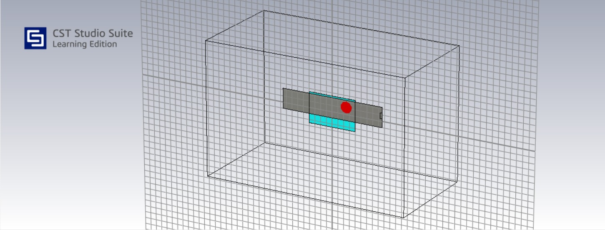
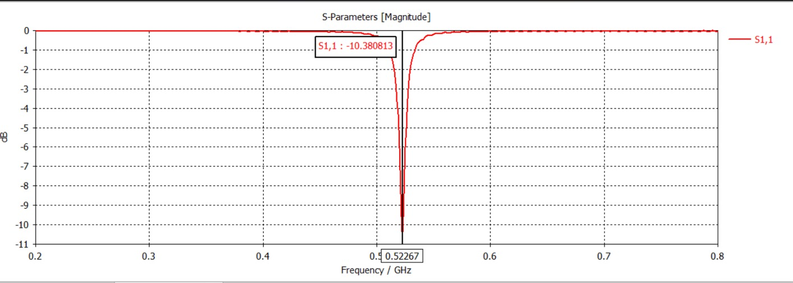

# UHF Antenna Simulation

## Target

**Target frequency:** 446 MHz

The UHF antenna is being investigated for the lower-frequency communication link of the KAVACH-RF system.

---

## CST Model

The antenna geometry was modelled and analyzed using CST Studio Suite.



---

## Current Simulation Result

The present simulation produces a resonance at:

**522.67 MHz**

The corresponding simulated reflection coefficient is approximately:

**S11 = −10.38 dB**



---

## Result Interpretation

The simulation demonstrates an identifiable resonant response with an S11 below −10 dB at the simulated resonance.

However, the resonance is currently shifted from the intended **446 MHz target**.

### Current status

**Frequency retuning required**

---

## Optimization Direction

The next design iteration will investigate changes to:

* Radiator dimensions
* Feed position
* Matching configuration
* Substrate/material parameters
* Helmet integration effects

The objective is to move the resonance toward **446 MHz** while maintaining suitable impedance matching.

---

## Target vs Current Result

| Parameter |   Target | Current Simulation |
| --------- | -------: | -----------------: |
| Frequency |  446 MHz |         522.67 MHz |
| S11       | ≤ −10 dB |          −10.38 dB |

---

## Validation

The simulated result will eventually be compared with the fabricated antenna using a VNA.

```text
CST Simulation
      ↓
Prototype Fabrication
      ↓
VNA Measurement
      ↓
Measured S11
      ↓
Simulation vs Measurement
```

> **Status:** Simulation completed — frequency optimization pending.
